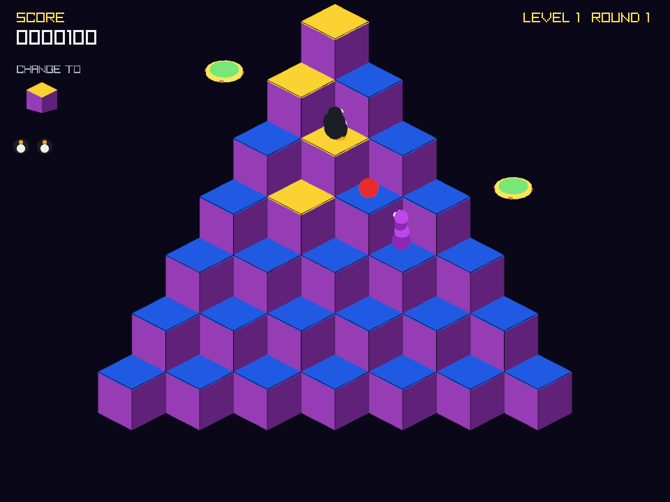

# TUX*BERT

A 3-D Q*bert-style arcade game starring Tux the Linux penguin, built with
Python and [raylib](https://pypi.org/project/raylib/). The art is 3-D, but it
plays like the 1982 cabinet: hop diagonally on the beat, repaint every cube,
and don't let Coily catch you.



## Run it

Double-click `start.bat` (it installs the requirements if needed). To set up
dependencies ahead of time, run `install_requirements.bat`. Or by hand:

```
pip install -r requirements.txt
python tuxbert.py
```

`python tuxbert.py --level 17` starts a new game at level 17 (1-25).

## Controls

| Key | Action |
| --- | --- |
| ↑ / W | hop up-right |
| ← / A | hop up-left |
| → / D | hop down-right |
| ↓ / S | hop down-left |
| P | pause |
| M | music on / off |
| ENTER | menus / start |

## 25 levels

Every level is a different cube structure: PYRAMID, SQUARE, DIAMOND,
STAIRWAY, T-TOWER, ARROW, CROSS, TWIN PEAKS, BIG PYRAMID, U-TUBE, H-BLOCK,
BASTION, THE Z, PINWHEEL, HOURGLASS, WINDOW, CANYON, BUTTERFLY, SWISS CHEESE,
COMB, RING, DONUT, SERPENT, SPIRAL, and the 45-cube finale MOUNT TUX.
Holes, one-cube bridges, and narrow corridors are all fatal drops — the
camera reframes itself to fit each shape. Clear level 25 and the shapes loop
with the difficulty still climbing.

## Arcade rules

- Land on a cube to change its top color; repaint the whole structure to
  clear the level. Levels 1-8 take one hop per cube, levels 9-16 take two,
  and from level 17 finished cubes toggle back off if you land on them again,
  Q*bert-style.
- **Red balls** bounce down the pyramid — touching one costs a life.
- **Coily** hatches from a purple egg at the bottom and chases you as a
  spring-snake. Hop onto a **flying disc** at the pyramid's edge and he'll
  leap to his doom (500 pts) while you ride back to the top.
- **Slick** (green, shades) un-paints cubes — squash him for 300 pts.
- **Green balls** freeze all enemies for a few seconds when caught (100 pts).
- Hop off the edge without a disc and you fall. `@!#?@!`
- Unused discs pay 50 pts each at round end; extra life at 8,000 pts and
  every threshold after.

High scores (top 10, three initials, arcade style) persist in
`highscores.json`. Sounds are square-wave chirps synthesized on first launch
into `assets/`.

## Music

Two looping tracks live in `music/`: a menu theme and a gameplay loop. The
menu theme also covers the high-score and game-over screens. Press **M** at
any time to toggle music; pausing with **P** pauses the track with it.
